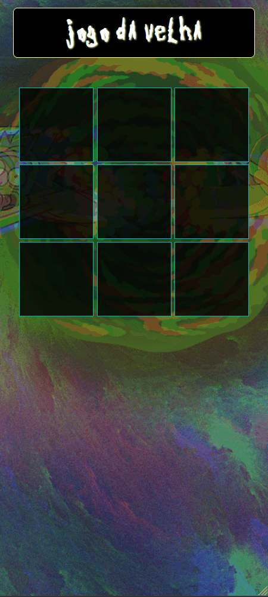

<h1 align="center">Jogo da Velha</h1>

Jogo da Velha single player com tema de Rick and Morty.
 

DIVIRTA-SE

<h3 align="center"><a href="https://mienblack.github.io/jogo-da-velha/" target="_blank"><strong>[ JOGUE AGORA ]</strong></a></h3>

---

 

  
  

## 💻 Projeto

Este jogo da velha utiliza DOM e recursos do CSS para as modificações visuais na tela.

## 🚀 Tecnologias

As seguintes ferramentas foram usadas na construção do projeto:

- [Javascript]
- [HTML]
- [CSS]

Made with 💟 by Damien Costa ✌🏿

<a href="https://www.linkedin.com/in/damien-costa-969953164/" target="_blank">
